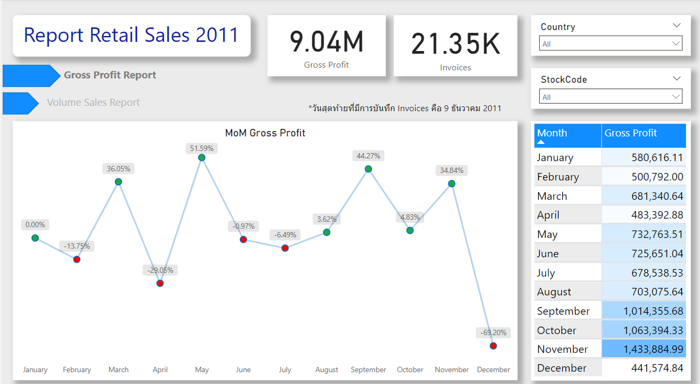

# Table of Contents
[Background](#background-) 
[Dataset overview](#dataset-overview-) 
[Summary](#summary-) 
[Insights Deep Dive](#insights-deep-dive-) 
[Recommendations](#recommendations-)

## Background 
&emsp;ชุดข้อมูลเป็นของธุรกิจค้าปลีกแบบออนไลน์แห่งหนึ่ง (ไม่ได้มีการระบุชื่อในแหล่งตั้งต้น แต่จากชุดข้อมูลคาดว่าต้นทางมาจาก UK) โดยได้มีการค้าขายส่งออกทั่วโลกถึง 37 ประเทศ! ข้อมูลที่มีนั้นเป็นรายการ Invoices คลอบคลุมทั้งปี 2011 กว่า 20,000 รายการ
&emsp;เพื่อสรุปผลประกอบการและมองหาแนวทางในการวางแผนการตัดสินใจทางธุรกิจขั้นถัดไป scope areas ที่วิเคราะห์มีดังนี้
- **Sales Tends Analysis**
&emsp;วิเคราะห์หารูปแบบการขายที่เปลี่ยนไปในแต่ละเดือน โดยจะใช้ Key metrics เป็น Gross Profit, Volume Sales, MoM (%growth rate)

*ขอขอบคุณแหล่งข้อมูลจาก Kaggle https://www.kaggle.com/datasets/umerkk12/online-retail-business*

## Dataset overview 

ข้อมูลชุดนี้หลังจากถูกกรองและแก้ไขแล้วมีข้อมูลกว่า 500,000 Records ประกอบไปด้วย
- InvoicesNo
- InvoicesDate
- StockCode
- Description : โดยรวมแล้วคือ ชื่อของสินค้า แต่ด้วยเหตุผลบางอย่าง สินค้าบางรายการที่มี StockCode เดียวกัน กลับมี Description ที่ต่างกัน
- UnitPrice
- Quantity
- CustomerID : ลูกค้าที่ไม่ได้ลงทะเบียนจะไม่มี ID
- Country

## Summary 
&emsp;ยอดขายของสินค้าในปี 2011 มีการเติบโตอย่างต่อเนื่อง โดยตั้งแต่เดือนมกราคมถึงพฤศจิกายน ยอดขายมีการเติบโตในอัตรา 9.4% ต่อเดือน ในขณะที่ยอดการสั่งสินค้า (Volume Sales) เพิ่มขึ้นในอัตราที่ใกล้เคียงกัน 9.14% ต่อเดือน
&emsp;ยอดขายสินค้ามีการลดลงต่ำอย่างมากในเดือนเมษายน ซึ่งมีผลต่อภาพรวมของรายได้จากการขายอย่างมาก ซึ่งในส่วนนี้มีค่าควรแก่การศึกษาถึงปัญหาที่เกิดขึ้น

ดาวน์โหลด Power BI Dashborad ได้[ที่นี่](./Retail.pbix "download") 

## Insights Deep Dive 
- เดือนที่มียอดขายที่ต่ำที่สุด คือ เดือนเมษายน ที่มียอดขายรวมเกือบเท่ากับเดือนธันวาคมซึ่งมีบันทึกการขายแค่ 9 วันเท่านั้น
- ในเดือนพฤศจิกายนซึ่งเป็นเดือนที่มียอดขายสูงสุด เมื่อสังเกตจำนวนการขายของสินค้าที่มีความนิยมสูงสุด 10 อันดับแรก พบว่าสินค้าส่วนใหญ่มีการเติบโตจากเดือนตุลาคมเกือบ 2 เท่า
[pic]()
- สินค้าที่ได้รับความนิยมสูงสุด ได้แก่ 22197 (SMALL POPCORN HOLDER), 84077 (WORLD WAR 2 GLIDERS ASSTD DESIGNS) และ 85099B (JUMBO BAG RED RETROSPOT)
- สินค้า 84077 (WORLD WAR 2 GLIDERS ASSTD DESIGNS) เป็น**สินค้าเดียวที่มีช่วงพีคในเดือนเมษายนและตุลาคม**และลงมาในจุดที่ค่อนข้างต่ำในเดือนพฤศจิกา
[pic]()

## Recommendations 
- ศึกษาในสาเหตุที่สินค้า 84077 (WORLD WAR 2 GLIDERS ASSTD DESIGNS) มียอดขายที่เติบโตต่างจากสินค้าอื่น ๆ ซึ่งอาจเกิดจากการเปลี่ยนแปลงตามฤดูกาล (seasonal trend) หรืออาจเกิดกระแสภายนอก ซึ่งมีผลให้ยอดขายมีการเติบโตขึ้นแบบชั่วคราว คำถามต่อไปคือ การเพิ่มการผลิตสินค้า 84077 เพื่อรองรับความต้องการในเดือนพฤศจิกา เป็นการลงทุนที่คุ้มทุนหรือไม่
- เป็นไปได้ไหมที่จะดึงยอดขายในเดือนเมษายนขึ้นมา? จากเดิมที่เดือนเมษายนนั้นมียอดขายที่ต่ำลงในสินค้าแทบทุกตัว ซึ่งเป็นสิ่งที่มีสาเหตุอย่างแน่นอน หากสามารถหาสาเหตุดังกล่าวและวางแผนธุรกิจครอบคลุมในส่วนนี้ เป็นไปได้ว่ายอดขายโดยรวมต่อปีจะเพิ่มขึ้นอย่างมาก
- กว่า 90% ของคำสั่งซื้อ ถูกสั่งโดยลูกค้าที่มาจาก UK ในขณะที่กลุ่มลูกค้าอันดับ 2 ซึ่งมาจากเยอรมันนั้นมีคำสั่งซื้อเพียงแค่ 2.52% เท่านั้น จึงเกิดคำถามต่อมาว่า การส่งออกสินค้าไปยังต่างประเทศมีค่าเพียงพอต่อการลงทุนต่อหรือไม่ (การส่งออกต่างประเทศจะมีค่าขนส่งที่เพิ่มขึ้น ซึ่งส่วนนี้สามารถเลือกที่จะเก็บจากลูกค้าได้ แต่กระนั้นก็ส่งผลให้ลูกค้าเลือกซื้อจากแหล่งอื่นที่มีค่าใช้จ่ายน้อยกว่าแทนได้เช่นกัน)
*คาคการว่าบริษัทเจ้าของข้อมุลอยู่ที่ UK
